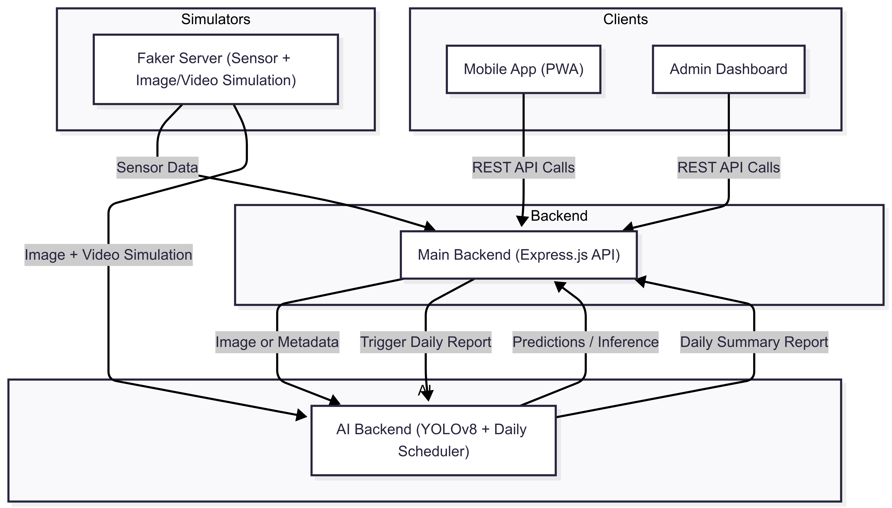

# 🐟 FIRMATECH — Smart Fish Farming System

**Empowering aquaculture through automation, AI, and real-time insights.**

FIRMATECH is an AI-integrated, modular aquaculture platform built for real-world farm automation. It supports intelligent fish counting, disease detection, biomass estimation, environmental monitoring, and more.

---

## ✅ Core Features

### 🌊 Environmental Monitoring

* Real-time tracking of critical water parameters:
  * Oxygen (O₂)
  * pH level
  * Temperature
  * Nitrite / Nitrate
  * Ammonia *(optional)*
* Rule-based threshold detection with customizable limits
* Smart notifications (Push/SMS) when thresholds are exceeded
* AI-based turbidity (water clarity) estimation via camera
* Feeding history management
* Local data caching with automatic cloud synchronization

---

### ⚠️ Alerting System

* Instant anomaly detection via sensor or image analysis
* Alert types:

  * **Critical** — Push + SMS
  * **Warning** — Push only
* Real-time alert feed with resolution tracking

---

### 📉 Computer Vision Integration

* **Fish Counting** — Real-time or periodic
* **Biomass Estimation** — Length prediction model
* **Disease Detection** — For Tilapia (e.g., lesions, discoloration, abnormal behavior)

---

### 📲 Accessibility & Usability

* Simple interface for low-literacy, rural users

---

### 📄 Automated Insights

* End-of-day AI-generated reports:
  * Health status
  * Water quality summary
  * Growth trends
  * Feed efficiency (if applicable)
  * Suggested actions

* Export options:
  * PDF for digital

---

## 🗂️ Repository Structure

| Purpose                 | Repository Name         |
| ----------------------- | ----------------------- |
| Frontend Dashboard      | `firmatech-dashboard`   |
| Mobile/Web Application  | `firmatech-app`         |
| Core Backend (REST API) | `firmatech-backend`     |
| AI & Inference Service  | `firmatech-backend-ai`  |
| Faker Data & Simulators | `firmatech-fake-data-simulation` |

---

## 🧠 System Overview – Simulation & Backend Architecture

FIRMATECH consists of interconnected backend services for sensor/image/video simulation, real-time processing, AI inference, and data management.

---

### 🖧 Communication Overview

---

## 🔁 Backend Components & Simulation Services

### 1. 📡 Sensor Data Simulation (`firmatech-fake-server`)

* Sends simulated sensor readings to the backend at fixed intervals
* Backend checks threshold rules
* Triggers alert if abnormal values are detected
* Mimics real-time pond monitoring

---

### 2. 🖼️ Image Data Simulation

* Sends a simulated fish image to the AI backend on schedule
* AI model estimates fish weight
* Result is used to predict harvest readiness
* Represents snapshot-based fish monitoring

---

### 3. 🎥 Video Data Simulation *(In Progress)*

* Simulates tank video feed
* AI backend detects and counts fish from video
* Useful for estimating fish density and real-time activity
* *AI model is ready; video feed simulation is under development*

---

## ⚙️ Main REST API Backend (`firmatech-backend`)

### Responsibilities

* Core API services
* Dataset CRUD operations
* User & role management
* Interfaces with frontend, mobile app, and other services

---

### 🕒 Daily Report Scheduler

* Runs at the end of each day
* Collects:

  * Sensor metrics
  * Feeding records
  * Fish count or disease status (if available)
* Sends data to the **Agentic AI service**
* Receives back:

  * A health/growth summary
  * Recommendations
  * Report for export (PDF/SMS)